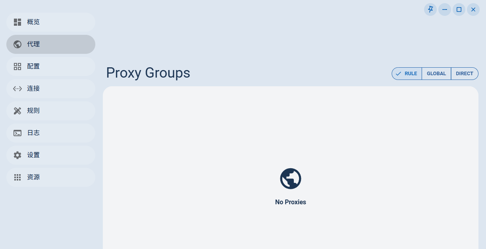
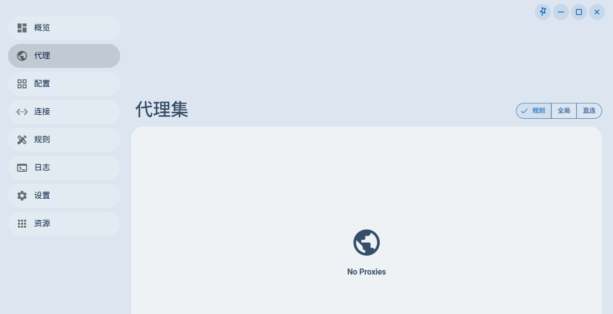

# Legacy proxy page localization

## Summary

- **Date:** 2026-08-06
- **Scope:** `frontend/chimera/src/pages/(legacy)/proxies.tsx`
- **Severity:** Medium — the proxy page visibly mixes English controls into an otherwise Chinese interface.
- **Environment:** Windows desktop Tauri E2E, WebView2 151.0.4129.59, locale `zh-cn`, deterministic window size 1240 × 638, isolated config/data directories.
- **Pre-reproduction base SHA:** `5f4d70885bbe2a318f9e42eda830271f3a669d9b`

## Bug contract

### Current buggy behavior

After selecting Chinese, creating a local Profile, activating it, and opening the legacy proxy page, the surrounding navigation is Chinese but the page title and proxy-mode controls remain English: `Proxy Groups`, `RULE`, `GLOBAL`, and `DIRECT`. The filter placeholder is also hardcoded as `Filter conditions` whenever the group sidebar is rendered.

The problem affects the legacy proxy page for every non-English locale because those labels bypass Paraglide message functions.

### Expected correct behavior

With locale `zh-cn`:

- the page title is `代理集`;
- mode controls are `规则`, `全局`, `直连`, and `脚本` when present;
- the group filter placeholder is `筛选条件` when rendered;
- no English `Proxy Groups`, `Rule`, `Global`, or `Direct` labels remain in those controls.

## Reproduction

The E2E test follows this application path:

1. Start Chimera with isolated config and data directories and a fixed 1240 × 638 window.
2. Set the application locale cache to `zh-cn`.
3. Navigate through the sidebar to 配置.
4. Open the new Profile dialog, select 本地配置, enter `TDD 本地配置`, and confirm through the UI.
5. Write the deterministic local fixture to the Profile through the real Tauri `save_profile_file` command.
6. Clear the current Profile, then click the Profile card to exercise UI activation.
7. Navigate through the sidebar to 代理.
8. Capture the page and assert that localized title and mode labels replaced the English labels.

Focused command:

```powershell
$env:CI='1'
$env:CHIMERA_E2E_EVIDENCE_PATH='I:\mfsga\Chimera\docs\bugfixes\2026-08-06-legacy-proxy-localization\before.png'
pnpm --filter @chimera/tauri-e2e exec wdio run ./wdio.conf.ts --spec ./specs/proxy-localization.e2e.ts
```

Observed failure:

```text
AssertionError [ERR_ASSERTION]: Expected values to be strictly equal:
true !== false
at proxy-localization.e2e.ts:156:12
Spec Files: 0 passed, 1 failed, 1 total
```

The assertion fails because `document.body.innerText` still contains `Proxy Groups`. The screenshot is captured immediately before the failing assertions.

## Before evidence



The Chinese sidebar establishes the active locale, while `Proxy Groups` and the three proxy modes visibly remain English.

## Reference implementation

The local `ref/` tree does not contain an equivalent current legacy proxy page. Its current proxy-related UI consistently obtains labels from generated internationalization functions rather than hardcoding display strings. Relevant examples include:

- `ref/frontend/nyanpasu/src/pages/(main)/_modules/header-settings-action.tsx`, which maps proxy modes to generated `settings_system_proxy_*_mode_label()` functions;
- `ref/frontend/nyanpasu/messages/*`, which defines localized proxy title and tray-mode keys.

Chimera already has suitable generated messages: `providers_proxies_title`, `logs_filter_placeholder`, and `tray_menu_proxy_mode_rule/global/direct/script`. The intended fix should adapt that message-function pattern instead of copying unrelated layout code.

## Test isolation and limitations

- Each run uses generated `CHIMERA_E2E_CONFIG_DIR` and `CHIMERA_E2E_DATA_DIR` paths; no real Profile or user configuration is read or written.
- The fixture sets `allow-lan: false` and `tun.enable: false` and only references the non-routable local endpoint `127.0.0.1:65535`.
- The E2E build also enables the existing `verge-dev` feature so startup initialization does not alter the host auto-launch entry.
- Windows proxy registry values were compared before and after the Red, focused Green, and full-suite runs and were byte-for-byte unchanged. The tests did not enable, disable, or redirect the system proxy.
- The isolated core exposed only its built-in `DIRECT`/`REJECT` state after Profile activation, so the custom fixture group and filter sidebar were not rendered. The test still proves Profile creation, persistence, UI activation, navigation, title localization, and mode localization. The filter placeholder is fixed from the same hardcoded site but is not visually covered by this Red screenshot.

## Root cause and fix

`proxies.tsx` imported Paraglide messages but bypassed them for the page title, filter placeholder, and every proxy-mode label. A module-level `MODE_LABELS` object stored English strings, while the title and placeholder used English string literals directly.

The fix keeps the existing layout and behavior and replaces those literals with existing generated message functions:

- `providers_proxies_title()` for the page title;
- `logs_filter_placeholder()` for the filter placeholder;
- `tray_menu_proxy_mode_rule/global/direct/script()` for the mode controls.

The mode map stores functions rather than resolved strings so it follows the same generated-message pattern as `ref/` and resolves the active locale when rendered.

## After evidence and comparison



At the same 1240 × 638 window size and after the same Profile journey, the title changed from `Proxy Groups` to `代理集`; the mode controls changed from `RULE / GLOBAL / DIRECT` to `规则 / 全局 / 直连`. Navigation and empty-state content are otherwise unchanged.

## Verification

- **Red evidence commit SHA:** `1a62f1ec2e801f1b7a9944663ed27effd156dc1e`
- **Final tested production-file blob SHA:** `c63d386697279de23492d4d7f7f81d06897307aa`

Commands and results:

```text
pnpm --filter @chimera/tauri-e2e exec wdio run ./wdio.conf.ts --spec ./specs/proxy-localization.e2e.ts
1 passing; exit 0; Windows proxy state unchanged

pnpm --filter @chimera/tauri-e2e typecheck
exit 0

pnpm exec prettier --check frontend/chimera/src/pages/(legacy)/proxies.tsx tauri-e2e/specs/proxy-localization.e2e.ts docs/bugfixes/2026-08-06-legacy-proxy-localization/report.md
all matched files use Prettier code style; exit 0

pnpm exec oxlint frontend/chimera/src/pages/(legacy)/proxies.tsx
exit 0

pnpm --filter=chimera-ui build
Vite production build completed; exit 0

cargo build --manifest-path ./backend/tauri/Cargo.toml --features e2e,verge-dev
debug E2E binary built; exit 0 (existing compiler warnings only)

pnpm --filter @chimera/tauri-e2e test
2 spec files passed, 5 tests passed; exit 0; Windows proxy state unchanged
```

## Remaining risks and follow-up

- The automated screenshot cannot show the translated filter placeholder because the isolated core does not expose the fixture's custom group, and the page omits the sidebar when no proxy groups are available. The placeholder now uses the already translated `logs_filter_placeholder` message, but a future core-backed fixture improvement could add direct visual coverage.
- The `No Proxies` empty state remains English. It is a separate existing hardcoded label outside the reported title/mode/filter scope and should be handled in a follow-up localization pass rather than expanding this bug fix.
- WebdriverIO emits non-fatal Windows diagnostics about executable permission bits and repeated window-state polling warnings; both focused and full suites nevertheless completed successfully.
