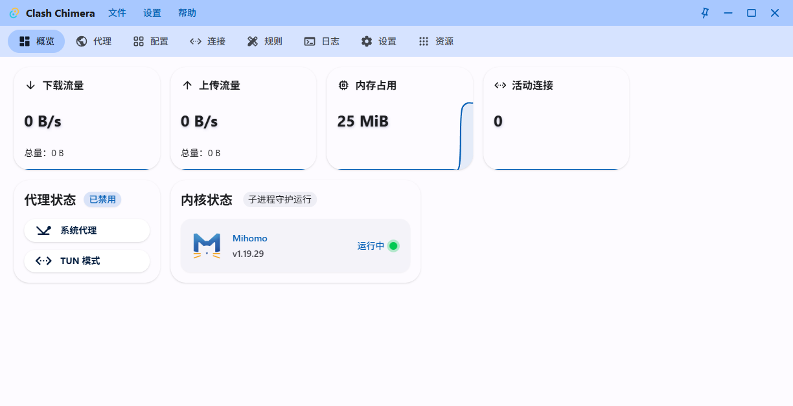

# Main dropdown menu does not open

## Summary

The ref-style dropdown menu used by the Main window header does not open when its trigger is clicked. The Settings trigger remains in `data-state="closed"`, no menu is mounted, and the user cannot access the header Settings actions.

## Environment

- Platform: Windows
- WebView2 / Edge runtime observed by WebdriverIO: 151.0.4129.72
- Viewport: 1240 × 638
- Test boundary: WebdriverIO Tauri E2E using the embedded WebDriver provider
- Runtime/config data: isolated under the E2E runtime directory configured by `tauri-e2e/wdio.conf.ts`

## Scope and severity

- Scope: Main window header dropdowns using `frontend/chimera/src/components/main-ui/dropdown-menu.tsx`.
- Directly reproduced: Settings menu.
- Severity: medium. Core proxy operation is unaffected, but the Main header Settings actions are inaccessible through this menu.

## Current buggy behavior

1. Open the Main window.
2. Click the `设置` button inside `[data-slot="app-header"]`.
3. The button remains `data-state="closed"`.
4. `document.querySelectorAll('[role="menu"]')` returns zero elements.

Observed state:

```text
triggerState: closed
roleMenuCount: 0
AssertionError: 'closed' !== 'open'
```



## Expected correct behavior

After clicking the Main header Settings trigger:

- the trigger becomes `data-state="open"`;
- the dropdown content is mounted and visible;
- the ref geometry contract is preserved: 4 px menu radius and three 48 px top-level items;
- the legacy dropdown primitive remains unchanged.

## Automated reproduction

Regression test:

```text
tauri-e2e/specs/main-dropdown-menu.e2e.ts
```

Exact reproduction command:

```bash
CHIMERA_E2E_EVIDENCE_PATH='../docs/bugfixes/2026-08-08-main-dropdown-menu/before.png' pnpm --filter @chimera/tauri-e2e exec wdio run ./wdio.conf.ts --spec ./specs/main-dropdown-menu.e2e.ts
```

The test fails specifically because the trigger remains closed after a successful WebDriver click; the Tauri application and embedded WebDriver session start successfully.

## Base SHA

Pre-reproduction base SHA:

```text
1b72fbb8b717cd408595acb8a0fffaf86af99cac
```

## Reference implementation

The analogous implementation was inspected in:

- `ref/frontend/nyanpasu/src/components/ui/dropdown-menu.tsx`
- `ref/frontend/nyanpasu/src/pages/(main)/_modules/header-settings-action.tsx`
- `ref/frontend/nyanpasu/src/pages/(main)/_modules/header-menu.tsx`

The Chimera ref-style dropdown implementation is structurally very close to the reference. One relevant environment difference is dependency versions: the reference currently uses `radix-ui` 1.6.7 and `@radix-ui/react-use-controllable-state` 1.2.6, while Chimera uses 1.6.4 and 1.2.4 respectively. This is an investigation lead, not yet established as the root cause.

## Test isolation and limitations

- The E2E harness uses isolated config/data directories and restores captured Windows proxy settings on completion.
- The test does not enable TUN mode, alter the host proxy, restart services, or use real user data.
- Only the Settings trigger is asserted directly. File and Help use the same new dropdown primitive, so they may share the same defect, but that has not been separately claimed as reproduced.
- WebdriverIO prints a Windows-inapplicable executable-permission diagnostic (`Binary Permissions: 666`); the Windows application still starts and the test reaches the intended UI assertion, so this is not the failure cause.

## Completion

Red evidence commit: pending.

Root cause, implemented fix, after screenshot, and final verification results will be added in the Green completion update.
