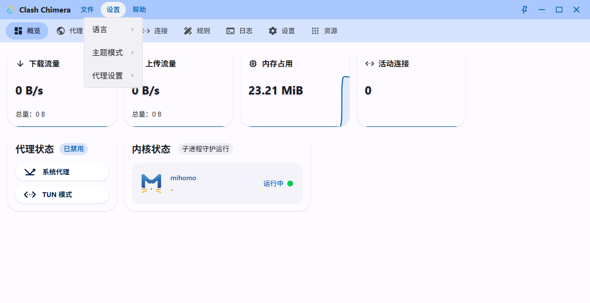

# Main dropdown E2E contract stabilization

## Summary

The initial regression run reported that the Main header Settings dropdown stayed closed after a WebDriver mouse click. Investigation showed that this was an E2E-driver false positive rather than a production dropdown defect. The embedded Tauri WebDriver provider emitted `mousedown` and `click` for the action but no `pointerdown`, while the Radix dropdown trigger opens on the pointer-down path. Keyboard activation opened the existing production menu correctly.

A second apparent geometry mismatch (46 px items instead of the ref 48 px) was also test timing: the measurement used `getBoundingClientRect()` while the Motion `scaleY` entrance animation was still active. Once the animation settles, the CSS height is 48 px as intended.

No production dropdown change was required.

## Environment

- Platform: Windows
- WebView2 / Edge runtime observed by WebdriverIO: 151.0.4129.72
- Viewport: 1240 × 638 (WebView content 1224 × 629)
- Test boundary: WebdriverIO Tauri E2E using the embedded WebDriver provider
- Runtime/config data: isolated under the E2E runtime directory configured by `tauri-e2e/wdio.conf.ts`

## Scope and severity

- Scope: `tauri-e2e/specs/main-dropdown-menu.e2e.ts` and the Main dropdown reference contract.
- Production impact: none found. The existing Radix/ref-style dropdown opens correctly through its supported keyboard activation path.
- Test impact: medium. The old E2E interaction produced a false product failure and measured animated geometry before it reached the final layout.

## Red behavior

The Red test used the embedded provider's mouse action and observed:

```text
triggerState: closed
roleMenuCount: 0
AssertionError: 'closed' !== 'open'
```

Event instrumentation during investigation showed the driver action produced:

```text
mousedown:0:false:false|click:0:false:false|
```

There was no `pointerdown` event. Focusing the same trigger and pressing Enter immediately produced:

```text
triggerState: open
roleMenuCount: 1
```

The first geometry read then returned `[46, 46, 46]` because it sampled `getBoundingClientRect()` during the menu's `scaleY` entrance animation.


## Expected stable contract

The E2E test should validate the layout without depending on pointer events that the embedded provider does not emit:

- activate the Settings trigger through keyboard Enter;
- wait for the Motion transform to settle;
- assert the menu is mounted and the trigger is open;
- assert a 4 px menu radius;
- assert three 48 px top-level items using computed CSS height;
- leave the legacy dropdown primitive and production dropdown implementation unchanged.

## Test fix

`tauri-e2e/specs/main-dropdown-menu.e2e.ts` now:

1. scopes the Settings trigger to `[data-slot="app-header"]`;
2. focuses the trigger and presses Enter;
3. waits until the dropdown Motion transform reaches its settled state;
4. measures item CSS heights via `getComputedStyle(...).height` instead of transformed bounding boxes.



## Reference implementation

The analogous implementation was inspected in:

- `ref/frontend/nyanpasu/src/components/ui/dropdown-menu.tsx`
- `ref/frontend/nyanpasu/src/pages/(main)/_modules/header-settings-action.tsx`
- `ref/frontend/nyanpasu/src/pages/(main)/_modules/header-menu.tsx`

The Chimera dropdown implementation matches the reference structure and uses `h-12` (48 px) for the relevant menu items. A temporary production-state workaround and a drag-region hypothesis were both tested and rejected; neither changed the pointer result, and no such workaround remains in production code.

## Evidence commits

Pre-reproduction base SHA:

```text
1b72fbb8b717cd408595acb8a0fffaf86af99cac
```

Red evidence commit:

```text
a8b779e1dcafe8c17743caa38f5289d53d71d559
```

Green stabilization commit:

```text
9b5497bf2565b99f6665e02357723edc9e3f277e
```

## Verification

Focused stabilized test:

```bash
CHIMERA_E2E_EVIDENCE_PATH='../docs/bugfixes/2026-08-08-main-dropdown-menu/after.png' pnpm --filter @chimera/tauri-e2e exec wdio run ./wdio.conf.ts --spec ./specs/main-dropdown-menu.e2e.ts
```

Result: 1 spec passed, 1 test passed.

Broader Main UI regression run:

```text
15 spec files passed, 0 failed.
```

Additional validation:

```text
pnpm --filter @chimera/tauri-e2e typecheck  -> passed
pnpm e2e:tauri:build                       -> passed
pnpm lint                                  -> passed
```

`pnpm lint` still reports existing Rust compiler/clippy warnings, but exits successfully with no lint failure.

## Test isolation and limitations

- The E2E harness uses isolated config/data directories and restores captured Windows proxy settings on completion.
- The test does not enable TUN mode, alter the host proxy, restart services, or use real user data.
- The embedded WebDriver provider's lack of `pointerdown` in this action path means this test is intentionally a layout/contract test, not proof of physical mouse-event delivery.
- WebdriverIO prints a Windows-inapplicable executable-permission diagnostic (`Binary Permissions: 666`); the Windows application starts successfully and the diagnostic is unrelated to these assertions.
